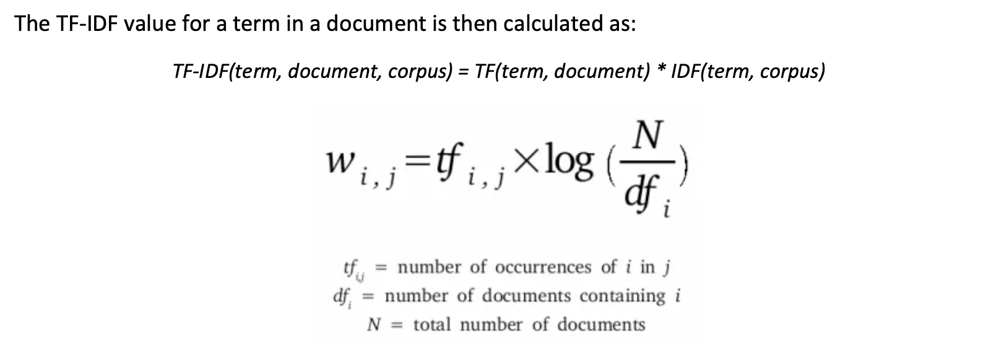
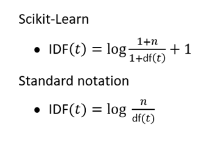

# Thomas Madeley Hiscox TF IDF 

### Context. 

Hi there, thank you for taking the time to read my submission. I will briefly summarise my approach and attempt to explain
some of the decision-making process and tradeoffs made. 


## Task

*Your task is to implement the Term Frequency-Inverse Document Frequency (TF-IDF) algorithm from
scratch in Python, without using any pre-built packages or libraries. You may use NLTK or other
libraries for tokenization, stemming, and other preprocessing tasks.*

TF-IDF (Term Frequency-Inverse Document Frequency) is a numerical statistic used to evaluate the importance of a word in a document relative to a collection of documents (corpus). It combines two measures: term frequency (TF), which assesses how frequently a term appears in a document, and inverse document frequency (IDF), which gauges how common or rare the term is across all documents. By multiplying these two factors, TF-IDF highlights words that are important to specific documents while downplaying common words found across many documents.

Essentially, we need to reproduce the below calculation over a small set of documents provided in the brief. 



### Additional Features

1. **Scikit-Learn Implementation**

We can optionally also follow the sklearn TF-IDF calculation using the below formula. This is done so we can 
evaluate and sense check my method against sklearn. 



- The smoothing factor prevents 0 division which may occur when using a vocabulary with terms with no usages.
- We are essentially saying we have an extra document that contains all terms
- We also add 1 to the IDF term to prevent terms in all documents have a 0 IDF score. (Full explanation below)

2. **Normalisation of TF and TF-IDF Scores**

We can optionally normalise both the Term Frequencies and TF-IDF Scores using L1 and L2 normalisation or no normalisation at all.

- L1 Normalisation:
  - Normalising the term frequency counts by the sum of the term counts: Term Frequencies sum to 1. 
  - Normalising the TF-IDF scores by the sum of the TF-IDF scores: TF-IDF scores sum to 1. 
- L2 Normalisation:
  - Normalising the term frequency counts by the square root of the sum of the squared term counts: squared Term Frequencies sum to 1. 
  - Normalising the TF-IDF scores by the sum of the TF-IDF scores: sum of squared TF-IDF scores sum to 1. 

**Why Normalize TF-IDF Vectors?**

- Consistency: It ensures that documents of different lengths are represented in a comparable manner.
- Stability: It can improve the numerical stability and performance of algorithms that are sensitive to the magnitude of input vectors.
- Cosine Similarity: Normalization, especially L2 normalization, is often used before computing cosine similarity between documents, as it simplifies the cosine similarity formula to a dot product.


Consider two documents, a long one and a short one:
Document A (short): 
[1,2,1]
Document B (long):
[5,10,5]

After L1 normalization:
- Document A: [1/4, 2/4, 1/4] = [0.25, 0.5, 0.25]
- Document B: [5/20, 10/20, 5/20] = [0.25, 0.5, 0.25]

The cosine similarity calculation can be simplified to a dotproduct if we use L2 normalisation, as both terms on the denominator become 1. 


# Solution

I will explain the solution fully during the interview, however there is a brief summary below and I hope that the code
is somewhat self documenting as well. 

The main components of the project are as follows:

1. **Preprocessing**: The `preprocessing` module handles the necessary preprocessing tasks, such as tokenization, 
 lemmatization, and removal of stopwords. It utilizes the NLTK library for these tasks, ensuring that the input 
 documents are properly cleaned and prepared for further processing.

2. **TF-IDF Calculation**: The core implementation of the TF-IDF algorithm resides in the `tfidf` module. This module 
contains functions to calculate term frequency (TF), inverse document frequency (IDF), and the final TF-IDF scores 
for each term in the documents. The implementation closely follows the mathematical formula shown in the image above.
Additionally, it implements the sklearn formula also - which is used for comparisons in 
`run_tfidf_functions_and_compare.ipynb`. 

3. **Utilities**: The `utils` module provides various utility functions that are used throughout the project. These 
 functions include loading NLTK resources, saving the results to a file, and other helper functions.

4. **Main Script**: The `main.py` script serves as the entry point of the project. It orchestrates the entire 
 process by calling the necessary functions from the different modules. It loads the corpus, performs preprocessing,
calculates the TF-IDF scores, and saves the results to a file. This can be executed from the CLI (instructions below).

5. **Run Config**: The parameters required for a run are passed to the module as a dictionary or JSON file (instructions below).

6. **Tests**: To ensure the correctness and reliability of the implementation, a comprehensive set of unit tests is 
included in the `tests` directory. These tests only cover the `tfidf.py` module, in practice all project functions
would be tested properly, with integration tests also. This is just an example of *how* I write tests.

7. **CLI Interface**: The TF-IDF Calculation can be run from the command line with a simple call!

```shell
tfidf_from_scratch calculate_tfidf
```

The project also includes uses `pip-compile` for dependency management, instructions for setting up your environment 
can be found below. 


### Why does Sklearn Implement Smoothing and add one? 


What if we have an out of vocabulary term? This will raise a zero division error.
```python
#1 document with term with no counts (out of vocabulary)
n_documents = 1
df_term = 0

idf = math.log(n_documents / df_term) -> ZeroDivisionError
```
Lets pretend we have a document containing that term and +1 df_term.

If we only smoothed the document frequency, we will get an idf score of 0.
```python
#1 document with term with no counts (out of vocabulary)
n_documents = 1
df_term = 0

assert math.log(n_documents /(1 + df_term)) == 0
```

Instead, we smooth both terms because:
1. This ensures we do not get any zero division. 
2. We are adding an addition 'document' that contains our term to the denominator, this document should be added to our count!

```python
#1 document with term with no counts (out of vocabulary)
n_documents = 1
df_term = 0

assert  math.log((n_documents + 1) / (df_term + 1)) >= 0

```

These **smoothing** terms are optionally added to the calculation using the **"smooth_idf":True** parameter. 

But wait, what if we have a term that appears in all documents, we can still get a zero idf score! 

This will ultimately give us a 0 TF-IDF score for that term.

Scikit-Learn adds an additional 1 to the IDF term so that we **never** get a 0 IDF term, even if the term appears in all documents. 
```python
#1 document with term with no counts (out of vocabulary)
n_documents = 2
df_term = 2

assert math.log((1 + n_documents)/(1 + df_term)) + 1 == 1
```

Overall this will not change the relative vector relationships between our documents, but it will change the magnitude of the TF-IDF scores


## Process

1. The text corpus is loaded from a parquet file (see `dataset_creation.ipynb`)
2. The corpus is preprocessed using the funcitons from the `text_pre_processing.py` module
3. The TF, DF, IDF and TF-IDF scores are calculated using the functions in the `tfidf.py` module
   - Optionally, we apply normalisation to the TF and TF-IDF calculations
   - Optionally, we apply smoothing and the sklearn 'add_one' to the TF-IDF calculation. This allows us to compare the
   two implementations in `run_tfidf_functions_and_compare.ipynb`.

Overall, I hope this project demonstrates my ability to, approach a problem logically, write high quality production code 
and program algorithms from scratch. I enjoyed making it! 


# Instructions


## Package usage

## Set up and installation

We have created a `Makefile` to house some helpful commands to manage dependencies and set up a suitable Conda environment. 

You must have some form of Conda installed for this to work. 

#### Create Environment and install the package in editable mode
Run the command below from the root directory, and answer `y` when asked about installation of dependencies.

This will automatically create a conda environment and ipykernel kernel for use in a jupyter notebook. 

```shell
make create_environment
```

If you need to update the dependencies, simply add the new package name(s) to `requirements.in` and then run:

```shell
make update_requirements

make dev_install
```

This will use pip-tools to search for compatible versions of all dependencies, then install the new dependencies in your conda environment. 


**Note** Make sure you set up a suitable conda environment using the instructions above first. 

The package is configured to be runnable in a functional way (ie importing functions and running them), or with a command
line interface, we will explain both usages below. 

Both approaches require a `run_config` dictionary as input that contains all required run arguments. 

        The Run Config should contain the following keys:
        - "path": str
            The path to the parquet file containing the corpus.
        - "norm": str, optional
            The normalization scheme to use for the TF and TF-IDF calculations.
            Possible values are "l1", "l2", or None.
        - "smooth_idf": bool, optional
            Whether to apply smoothing to the IDF values.
        - "add_idf": bool, optional
            Whether to add 1 to the IDF values .
        - "output_path": str, optional
            The path to save the calculated TF-IDF matrix and term-to-index mapping as a DataFrame.
            If not provided, the result will not be saved.


### Functional Usage

To use the main function in a functional way, simply import the `tfidf_from_scratch.__main__.main_calculate_tfidf` function
and use as follows:

```python
from tfidf_from_scratch.__main__ import main_calculate_tfidf

run_config = {
    "path": "path",
    "norm": "l2",
    "smooth_idf": False,
    "add_idf": True,
    "output_path": None,
}

tfidf_matrix, vocabulary = main_calculate_tfidf(run_config)
```
The component functions from this pipeline are also available to import if you would like to customise the 
pre-processing, data import or calculations further.

### CLI Usage
I have created a CLI interface for the main TF-IDF calculation function. This function requires a `run_config` 
dictionary to be passed. There is a default configuration stored in `constants.RUN_CONFIG`. 

To use the default config, simply: 
```shell
tfidf_from_scratch calculate_tfidf
```

To run with a custom run_config:
```shell
tfidf_from_scratch calculate_tfidf --config {path_to_json}.json
```

# If I Had More Time...


1. **Error Handling, & Testing** 
- We have implement unit tests for the TF-IDF calculations, but testing the text preprocessing functions would give us more confidence in our outputs.
- Our code may fall over if incorrect keys or values are passed in our run config or if unexpected values are found (div by 0 etc).
  - We could add more error handling to control the pipelines behaviour when this happens.
2. **Extending Functionality for New Texts and Refactoring**
- A potential use case for this tool is calculating TF-IDF scores for new texts, currently we are unable to do this without full retraining. 
  - We could refactor our code to an OOP format, creating a TF-IDF class. 
    - This could hold the IDF matrix, and calculate TF-IDF scores for new texts without retraining. 
    - We could implement more complex tokenisation to enable 'n-gram' 
    - Add new arguments like min word/max word frequencies.
    - We could parametrise the tokenisation and preprocessing steps:
      - 'object_from_dict' to load custom tokenizer etc. 
  - We could use the TF-IDF scores in many downstream processes and assess their performance:
    - To compare vectors by calculating a similarity score. 
    - Text summarisation
    - Input into a supervised model etc
3. **Performance Optimization - Out of scope**
- While our current implementation works well for small to medium-sized datasets, it may struggle with larger corpora due to the use of Python lists and dictionaries.
  - We could explore using NumPy arrays and SciPy sparse matrices to represent the term-document matrices more efficiently.
    - NumPy arrays offer faster numerical computations and better memory efficiency compared to Python lists. We can enhance this further with Numba!
    - SciPy sparse matrices are designed to handle large, sparse datasets, which is often the case with text data.
4. **Evaluation and Benchmarking**
- To assess the effectiveness and performance of our TF-IDF implementation, it would be valuable to conduct a comprehensive evaluation and benchmarking process.
  - We did compare our implementation to the scikit-learn implementation, it would be nice to extend this comparison to a large corpus.
  - Additionally, we could measure the runtime performance and memory usage of our implementation on different datasets and compare it with other libraries.
5. **Documentation and Examples**
- To facilitate the adoption and usage of our TF-IDF implementation, it is crucial to provide comprehensive documentation and illustrative examples.
- I have tried to effectively document the process within the limited time available however, in practice I would prefer to do more:
  - If this were a brand new algorithm:
    - Provide worked examples in the documentation and even docstrings, explaining the transformations and calculations taking place.
    - Put together notebooks executing the process in a stepwise manner.
6. **Deployment**
- While obviously out of scope, I would consider the following key aspects for deploying our TF-IDF implementation in a production environment:
  - Build a Custom Python Package
    - Package the implementation using standard Python packaging tools, such as setuptools or poetry.
    - Deploy the package to a private PyPI server, allowing controlled access and versioning for internal use.
  - Implement CI/CD with Version Control
    - Establish a robust CI/CD pipeline to automate the build, testing, and deployment processes for our TF-IDF package like using a yaml file.
    - Integrate version control, such as Git, to track changes, collaborate effectively, and maintain a clear history of the package's development.
  - Peer Review and Code Quality
    - Establish a peer review process to ensure high code quality and maintain consistency across the TF-IDF package.
